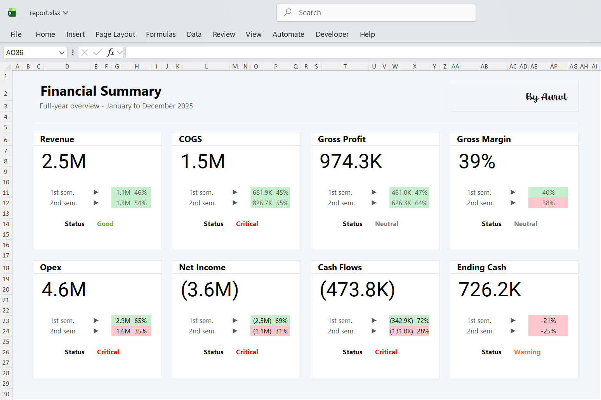

# Excel Financial Performance Dashboard — FY2025

Projet Excel end-to-end orienté **data analysis, business reporting et dashboarding**, conçu pour simuler une mission réaliste de **Data Analyst / Financial Analyst / Contrôle de gestion**.

<p align="center">
  
</p>

L'objectif est de partir de **données brutes volontairement imparfaites**, de les **nettoyer**, les **structurer**, les **enrichir**, puis de produire des **tables analytiques prêtes pour le reporting** ainsi qu'un **dashboard financier annuel** exploitable dans un contexte métier.

Ce projet met en avant ma capacité à travailler sur toute la chaîne de valeur de la donnée sous Excel :

- ingestion de données brutes,
- nettoyage et normalisation,
- enrichissement métier,
- construction de tables analytiques,
- agrégation de KPI,
- analyse financière,
- alimentation d'un reporting via Power Query.

---

## Vue d'ensemble

Ce projet a été conçu comme une **simulation réaliste d'un environnement entreprise** dans lequel un analyste doit :

- récupérer des données multi-sources incomplètes ou incohérentes,
- sécuriser leur qualité,
- appliquer des règles métier explicites,
- produire des indicateurs fiables pour la direction,
- séparer clairement la **préparation de la donnée** et la **couche de restitution**.

L'enjeu n'était pas seulement de construire un dashboard, mais de montrer la logique analytique complète qui permet d'obtenir un reporting fiable, traçable et exploitable.

---

## Ce que ce projet démontre

| Domaine de compétence       | Ce que ce projet démontre |
|----------------------------|---------------------------|
| **Excel avancé** | Formules structurées, tables Excel, formats personnalisés, logique de dashboarding, reporting orienté management |
| **Data cleaning** | Nettoyage de texte, standardisation des dates, gestion des valeurs manquantes, normalisation des catégories, logique de mapping |
| **Modélisation de données** | Tables de référence, tables de faits, tables finales de restitution |
| **Analyse métier** | Analyse du Revenue, COGS, Gross Profit, Gross Margin, OPEX, Net Income, Cash Flows, Ending Cash, ainsi que la comparaison Budget vs Actual |
| **Power Query / pipeline data** | Connexion entre `eda.xlsx` et `report.xlsx`, séparation entre la préparation analytique et la couche de restitution |

---

## Postes ciblés

Ce type de projet est directement pertinent pour des postes de :

- Data Analyst
- Financial Analyst
- FP&A Analyst
- Contrôleur de gestion
- Business Analyst
- Reporting Analyst

---

## Structure du projet

```bash
.
├── README.md
├── eda.xlsx
├── generate_raw_data.py
├── raw_data
│   ├── README.txt
│   ├── bank_transactions.csv
│   ├── budget_monthly.csv
│   ├── calendar.csv
│   ├── customers.csv
│   ├── opening_cash.csv
│   ├── operating_expenses.csv
│   ├── products.csv
│   ├── sales_order_lines.csv
│   └── sales_orders.csv
├── report.xlsm
└── report.xlsx
```

---

## Logique analytique du projet

Le projet suit une architecture simple et lisible :

**raw → clean → fact → reporting**

### 1. Données brutes

Des jeux de données synthétiques ont été générés pour reproduire un environnement d'entreprise couvrant plusieurs domaines :

* clients,
* produits,
* commandes,
* lignes de vente,
* dépenses opérationnelles,
* transactions bancaires,
* budgets,
* trésorerie d'ouverture,
* calendrier.

Ces données contiennent volontairement des imperfections réalistes :

* libellés incohérents,
* formats de dates mélangés,
* valeurs manquantes,
* bruit catégoriel,
* formats numériques non standards.

### 2. Nettoyage et normalisation

Le nettoyage a été conçu pour être **visible, traçable et auditable**.
Les données brutes n'ont pas été écrasées : les versions brutes et nettoyées coexistent dans Excel.

Le travail de préparation s'est concentré sur :

* la normalisation des textes,
* la reconstruction des dates,
* la conversion des formats numériques,
* la gestion des valeurs manquantes,
* l'harmonisation des catégories métier.

### 3. Standardisation métier

Une logique de mapping a été appliquée aux champs contenant des libellés incohérents, notamment :

* les canaux de vente,
* les types de dépenses,
* les catégories inconnues ou mal renseignées.

Cette étape sécurise les regroupements et les agrégations en aval.

### 4. Construction des tables de faits

Une fois les données nettoyées, trois tables analytiques principales ont été construites :

* `fact_sales`
* `fact_opex`
* `fact_cash`

Ces tables permettent de passer d'une logique opérationnelle brute à une structure exploitable pour l'analyse.

### 5. Couche de reporting

À partir des tables de faits, deux tables finales ont été produites :

* `financial_summary`
* `activity_survey`

Ces sorties alimentent ensuite `report.xlsx` via Power Query pour construire le reporting final et le dashboard.

---

## Principaux choix techniques

Chaque règle de nettoyage a été traitée comme une **décision métier explicite**, et non comme une simple correction technique.

### Nettoyage des textes

Standardisation des champs texte avec des fonctions telles que :

* `TRIM`
* `CLEAN`
* `SUBSTITUTE`
* `PROPER`
* `XLOOKUP`
* `LET`

Objectifs :

* supprimer les espaces inutiles,
* retirer les caractères parasites,
* harmoniser la casse,
* fiabiliser les libellés pour les regroupements.

### Nettoyage des dates

Plusieurs formats de dates coexistaient dans les sources.
Le traitement a inclus :

* la conversion en dates Excel valides,
* une logique de fallback pour les formats non standards,
* la création d'une clé mensuelle cohérente.

Sortie clé :  `year_month`

### Nettoyage des valeurs numériques

Les champs numériques ont été normalisés avec :

* `NUMBERVALUE`
* `IFERROR`
* gestion contrôlée des blancs
* règles explicites de remplacement

Cela a été essentiel pour fiabiliser :

* les prix,
* les remises,
* les coûts,
* les montants,
* les métriques de trésorerie.

### Modélisation Excel structurée

Le projet repose sur :

* des tables Excel structurées,
* des formules à références nommées,
* des tables de mapping,
* des références contrôlées,
* des tables de sortie prêtes à être consommées par Power Query.

---

## Hypothèses métier utilisées

Une partie importante du projet consistait à transformer des données incomplètes en **hypothèses explicites et défendables**.

| Champ                         | Règle appliquée                 | Justification                                                                                                       |
| ----------------------------- | ------------------------------- | ------------------------------------------------------------------------------------------------------------------- |
| `quantity` manquante          | `quantity = 1`                  | Dans un contexte transactionnel, une quantité absente est plus plausible comme vente unitaire que comme vente nulle |
| `discount_pct` manquant       | `discount_pct = 0`              | Une remise absente est interprétée comme absence de remise                                                          |
| `unit_selling_price` manquant | Remplacement par la **médiane** | La médiane est plus robuste que la moyenne face aux valeurs extrêmes                                                |
| Catégories texte manquantes   | Remplacement par `Unknown`      | Permet de conserver l'exhaustivité analytique sans supprimer les observations                                       |
| `country` manquant            | `France`                        | Maintient la cohérence géographique du scénario                                                                     |
| `region` manquante            | `Ile-de-France`                 | Évite de casser les analyses géographiques                                                                          |

L'objectif n'était pas de masquer l'imputation, mais au contraire de la rendre visible et justifiée.

---

## Calculs principaux du modèle

### Couche ventes

Les principales mesures calculées sont :

* `gross_amount = quantity × unit_selling_price`
* `net_revenue = gross_amount × (1 - discount_pct)`
* `cogs = quantity × standard_cost`
* `gross_profit = net_revenue - cogs`

Ces calculs permettent de passer de la transaction brute à une lecture de la performance commerciale et de la rentabilité.

---

## Indicateurs analysés

Le reporting final permet de suivre notamment :

* Revenue
* COGS
* Gross Profit
* Gross Margin
* OPEX
* Net Income
* Cash In / Cash Out
* Ending Cash
* Budget vs Actual

---

## Enseignements business mis en évidence

Ce projet permet de montrer qu'une hausse de l'activité ne garantit pas automatiquement la rentabilité.

Principaux constats mis en évidence par le modèle :

* la croissance du chiffre d'affaires peut coexister avec un résultat net négatif,
* les OPEX jouent un rôle central dans la dégradation de la rentabilité,
* une marge brute positive ne suffit pas à compenser une structure de coûts trop lourde,
* la trésorerie apporte une lecture complémentaire aux métriques de résultat,
* l'analyse **Actual vs Budget** permet d'identifier si la sous-performance vient du revenu, des coûts ou des dépenses.

> Le dashboard ne se limite pas à décrire l'activité : il soutient une interprétation managériale de la pression sur les marges, du poids des charges et de la dynamique de trésorerie.

---

## Aperçu du dashboard

<p align="center">
  
</p>

---

## Logique Power Query et reporting

Power Query est utilisé comme pont entre :

* le classeur analytique `eda.xlsx`,
* le classeur de restitution `report.xlsx`.

Cette séparation permet :

* un rafraîchissement reproductible,
* une distinction claire entre transformation et présentation,
* une logique scalable si les fichiers sources sont remplacés.

### Mise à jour du projet

Le processus de mise à jour suit cette logique :

1. remplacement éventuel des fichiers sources,
2. actualisation de `eda.xlsx`,
3. actualisation des connexions Power Query dans `report.xlsx`,
4. mise à jour automatique du reporting et du dashboard.

Cette organisation reflète une bonne pratique professionnelle : **ne pas mélanger la logique de préparation de la donnée avec la couche de restitution**.

---

## Compétences mobilisées

À travers ce projet, je démontre des compétences concrètes en :

* Excel avancé,
* data cleaning,
* modélisation analytique,
* structuration de KPI financiers,
* analyse Actual vs Budget,
* logique de trésorerie,
* reporting orienté métier,
* Power Query,
* conception de dashboards exploitables.

---

## Valeur ajoutée pour une entreprise

Au-delà de l'outil, ce projet montre ma capacité à :

* transformer des données imparfaites en information exploitable,
* formaliser des règles métier claires,
* construire un modèle de données structuré,
* produire un reporting fiable pour l'aide à la décision,
* séparer proprement préparation analytique et restitution.

C'est exactement le type de démarche attendu dans des fonctions d'analyse, de reporting ou de pilotage de la performance.